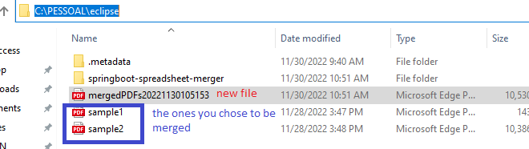

@author: Erik Alves 2022-11-27

# SpringBoot microservice to merge PDF files and optionally convert them into different file formats.

Tech stack:

	Java
	SpringBoot
	Maven

## About project

This micro-service has been developed to be extended to extra future functionalities, such as converting files, or to run as a REST API endpoint, or even to turn into a WEB project. 

It is a test/sample project but It follows principles such as SOLID and design patterns such as factory, business delegate. 

### Requirements
As an Administrative clerk I would like an automation utility (e.g. simple console app) that combines the contents from a list of PDF files into a single PDF file So that I can aggregate the results to a simple single file (e.g. send a single file to a distribution list and not be concerned with spamming its recipients)

### Acceptance Criteria:
An input list of PDFs can be selected (command line arguments are perfectly acceptable) An output file is provided (command line argument acceptable here as well)The contents of the source files are stored in PDF format into the output file.

## How to build the application (optional)

There is no need to build this maven project, but if wanted then run the following command once the project is cloned:

Build Spring Boot Project with Maven:
	
	mvn install / mvn clean install
* You will need Java 17 and Maven installed in your computer

## How to run the already built application jar (fat) file:

Simply run the already build jar (fat) file, via command line:

1 - Copy the application's jar file to a preferred directory and type:

(View from Windows command line console)

 Copy and paste this command in a console:
 	    
			java -jar springboot-spreadsheet-merger-0.0.1-SNAPSHOT.jar
			

2 - Once the micro-service runs you will be asked to type the directory where your pdf file(s) reside:

(View from eclipse console)

3 - As a result you should end up with an extra PDF file named as mergedPDFs + timestamp in the same directory you had your PDF files.

